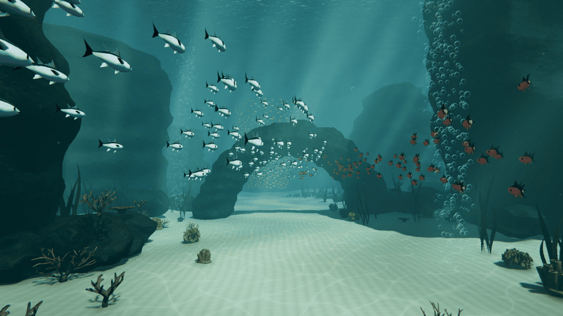
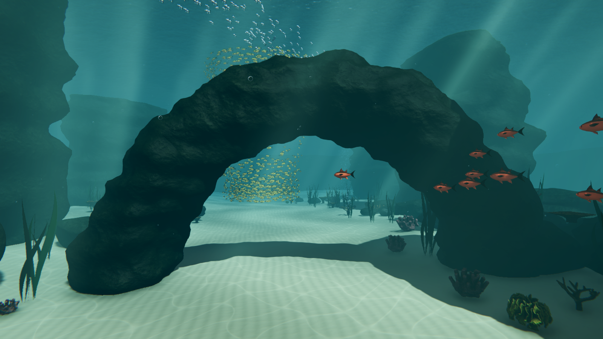
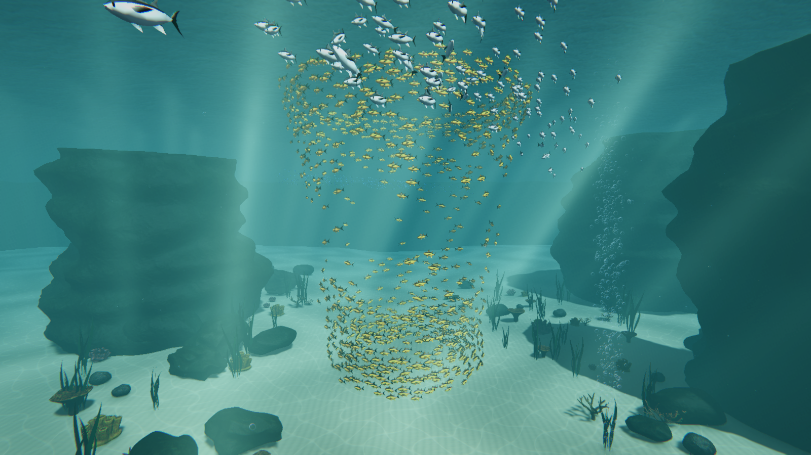

# Boids · Unity URP

[English](#english) | [简体中文](#简体中文)

## English

A Unity learning and portfolio project for coherent underwater schooling. The latest version combines local Boids rules with shared travel corridors, an independent vortex field and instanced rendering. Four schools contain **1,775 fish**, including a **960-fish vortex** already circulating from the first frame.

[Opening recording](docs/media/boids-opening.mp4) · [Schooling recording](docs/media/boids-schooling.mp4) · [Vortex close-up](docs/media/boids-vortex.mp4) · [Development](DEVELOPMENT.md) · [Plastic SCM history](docs/scm/HISTORY.md)

### Technical Highlights

| Technique | Implementation |
| --- | --- |
| Local flocking | Separation, velocity alignment and cohesion steer each fish within its own school |
| Spatial grid | Reusable 3D cell heads and linked indices restrict exact distance checks to the current cell and its 26 neighbors |
| Consistent state | Steering reads the same positions and velocities for all agents before integration |
| Coherent travel | Closed Catmull-Rom corridors, arc-length lookup, steering look-ahead and staggered nearest-segment progress correction |
| Vortex shaping | Tangential velocity, radial feedback and slowly varying vertical targets; stratified heights and golden-angle spawn distribution |
| Obstacle avoidance | Staggered forward sphere casts followed by candidate casts around the current heading |
| Simulation and rendering | Fixed 30 Hz simulation, interpolated transforms, four instanced fish draws per camera and vertex-shader tail animation |

Each school owns its state and grid. The vortex does not apply steering forces to the traveling schools. Guidance supplies a direction of travel; fish positions still come from integrated velocity.

The underwater scene has also been refined, with an animated water surface, depth-dependent absorption and scattering, shadowed light shafts, caustics, suspended particles and bubble columns.

### Run

1. Open the repository in **Unity 2022.3.62f2** and allow Package Manager to resolve **URP 14.0.12**
2. Open `Assets/BoidsUnderwaterScene/Scenes/Boids.unity`, or choose **Tools > Boids > Open Boids**
3. Press Play and click the Game view

WASD moves relative to the view, Q/E descends and ascends, Shift accelerates, the mouse looks around, and Escape releases the cursor. Click the Game view to lock it again.

Select a school to edit its route, speed, perception and separation settings. `UnderwaterEnvironment` controls the underwater optics. **Tools > Boids > Validate Boids** checks the scene and routes. **Rebuild Boids** regenerates the scene and its generated assets, replacing manual edits to that generated content.

The showcase recordings use licensed fish and environment assets. Their source files and baked derivatives are excluded from the repository. The included `Boids` scene uses generated fish, corals and textures alongside the authored arch and cliff meshes, with the same schooling runtime. It is the only scene distributed here.

### Code and Evidence

- [BoidsSchool.cs](Assets/BoidsUnderwaterScene/Scripts/BoidsSchool.cs): grid, local rules, corridor and vortex guidance, integration and instancing
- [BoidsUnderwaterSceneBuilder.cs](Assets/BoidsUnderwaterScene/Editor/BoidsUnderwaterSceneBuilder.cs): reproducible scene and school setup
- [BoidsSceneValidation.cs](Assets/BoidsUnderwaterScene/Editor/BoidsSceneValidation.cs): grid equivalence, school isolation, startup population and route checks
- [Architecture](docs/ARCHITECTURE.md) · [Validation](docs/VALIDATION.md) · [Capture notes](docs/media/README.md) · [Attribution](THIRD_PARTY_NOTICES.md)

The grid reduces neighbor candidates in this distribution; a dense cell can still approach quadratic work. Separation and sphere casts provide steering rather than rigid-body collision resolution. The vortex is an art-directed velocity field, and the water rendering uses real-time optical approximations. Burst/Jobs, GPU Boids and SDF interaction are not implemented.

The project began in Plastic SCM. The first Git commit was a publication snapshot; later work is recorded as actual Git updates. Earlier changesets remain in the [SCM archive](docs/scm/HISTORY.md), with the unrelated FFT work excluded. The independent ocean project is available at [FFT-Ocean-URP](https://github.com/supercoderrrrr/FFT-Ocean-URP).

References: [Craig Reynolds](https://www.red3d.com/cwr/boids/), [Sebastian Lague's tutorial](https://www.youtube.com/watch?v=bqtqltqcQhw) and [reference implementation](https://github.com/SebLague/Boids).

---

## 简体中文

这是一个 Unity 学习与作品集项目，展示具有共同游动方向的水下鱼群。新版将 Boids 局部规则、巡游通道、独立漩涡场与实例化渲染结合起来，四组鱼群共 **1775 条鱼**，其中 **960 条漩涡鱼从第一帧就已经环绕游动**。

[开场录像](docs/media/boids-opening.mp4) · [流动鱼群录像](docs/media/boids-schooling.mp4) · [漩涡近景](docs/media/boids-vortex.mp4) · [开发记录](DEVELOPMENT.md) · [Plastic SCM 历史](docs/scm/HISTORY.md)

### 核心技术

| 技术 | 实现方式 |
| --- | --- |
| 局部集群 | 在各自鱼群内计算分离、速度对齐与聚合 |
| 三维空间网格 | 复用单元格链表，仅检查当前格与周围 26 格，再按实际距离筛选邻居 |
| 统一状态快照 | 所有鱼先读取同一批位置和速度计算转向，再统一积分 |
| 连贯流向 | 闭合 Catmull-Rom 通道、弧长查询、前视转向，以及错开执行的最近线段进度校正 |
| 漩涡形态 | 切向速度、径向反馈与缓慢纵向起伏；分层高度和黄金角分布避免开场挤成一团 |
| 障碍规避 | 错开前向球形扫掠，遇到障碍后检测当前朝向附近的候选方向 |
| 模拟与绘制 | 30 Hz 固定步长、插值显示、每相机四次鱼群实例化绘制，以及顶点着色器摆尾 |

各组鱼群拥有独立状态和空间网格，漩涡力不会作用到流动鱼群。通道提供游动方向，鱼的位置仍由速度积分产生。

同时精修了海底场景，补充动态水面、随深度变化的吸收与散射、带阴影的丁达尔光、焦散、悬浮颗粒与气泡柱。

### 打开与操作

1. 使用 **Unity 2022.3.62f2** 打开仓库，等待安装 **URP 14.0.12**
2. 打开 `Assets/BoidsUnderwaterScene/Scenes/Boids.unity`，或选择 **Tools > Boids > Open Boids**
3. 进入 Play 并点击 Game 窗口

WASD 按观察方向移动，Q/E 下降与上升，Shift 加速，鼠标控制视角，Escape 释放鼠标，点击 Game 重新锁定。

选中 School 可以调整路线、速度、感知与分离参数；`UnderwaterEnvironment` 控制水下光学效果。**Validate Boids** 检查场景与路线，**Rebuild Boids** 会重新生成场景与资源并替换对应的手工修改。

展示录像使用了有许可限制的鱼与环境资源，源文件和烘焙衍生网格不随仓库分发。公开 `Boids` 场景使用生成的鱼、珊瑚和贴图，配合制作的拱门与岩壁网格，并运行同一套集群代码。仓库只分发这一套新场景。

核心实现见 [BoidsSchool.cs](Assets/BoidsUnderwaterScene/Scripts/BoidsSchool.cs)，原理与验证见 [ARCHITECTURE.md](docs/ARCHITECTURE.md) 和 [VALIDATION.md](docs/VALIDATION.md)。录像使用固定时间步，播放帧率不代表实际运行 FPS。

空间网格能减少当前分布下的候选数量，但极密集的单元格仍可能接近平方复杂度。分离和扫掠避障没有刚体碰撞约束，漩涡属于可控制的速度场，水面属于实时光学近似。尚未实现 Burst/Jobs、GPU Boids 或 SDF 交互。

项目最初使用 Plastic SCM 开发，首次 Git 提交是发布快照，后续改进通过真实 Git 提交记录。历史变更集保留在 [SCM 归档](docs/scm/HISTORY.md)，FFT 海洋单独发布于 [FFT-Ocean-URP](https://github.com/supercoderrrrr/FFT-Ocean-URP)。

学习参考：[Craig Reynolds](https://www.red3d.com/cwr/boids/)、[Sebastian Lague 的教程](https://www.youtube.com/watch?v=bqtqltqcQhw)与[项目](https://github.com/SebLague/Boids)。第三方署名与许可见 [THIRD_PARTY_NOTICES.md](THIRD_PARTY_NOTICES.md)。
