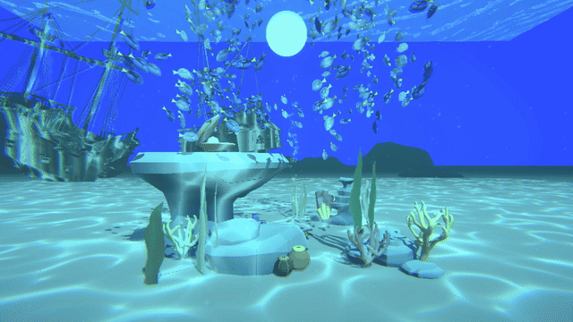
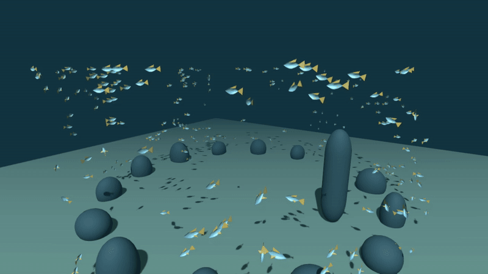
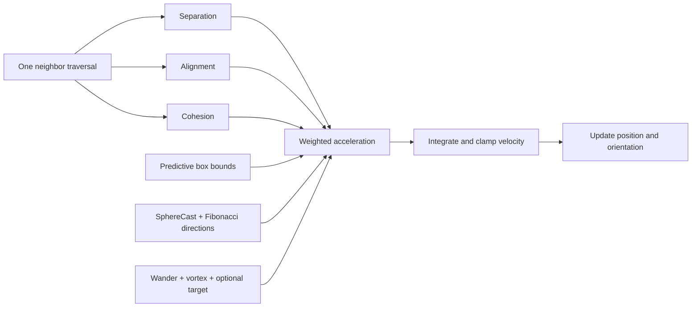
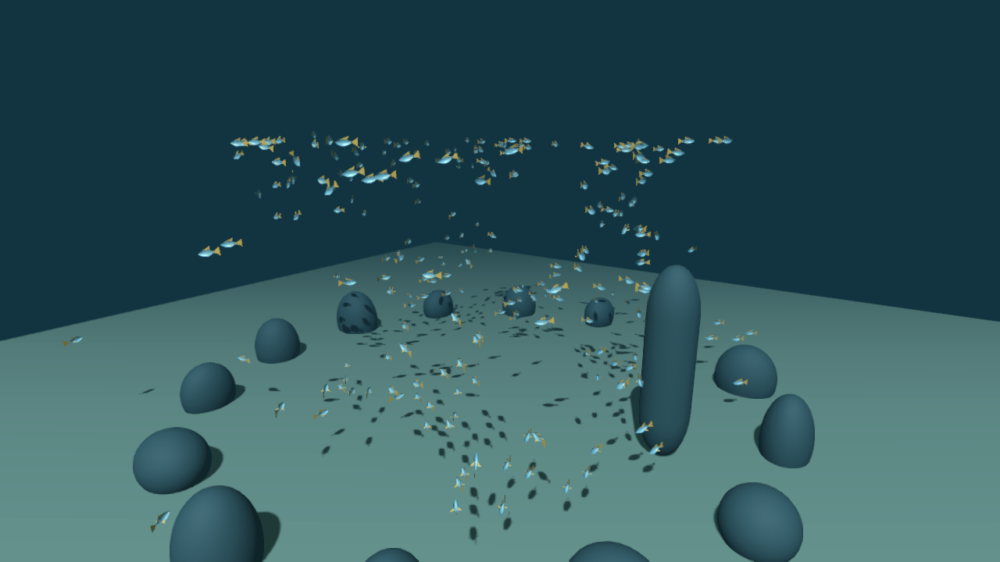

# Boids Underwater Schooling · Unity URP

[English](#english) | [简体中文](#简体中文)

## English

A Unity learning and portfolio project combining local Boids steering with predictive obstacle avoidance and an underwater presentation. Each agent integrates its own velocity; separation, alignment and cohesion are evaluated together in one CPU neighbor traversal.

[Original scene recording](docs/media/original-underwater.mp4) · [Public demo recording](docs/media/public-demo.mp4) · [Development archive](DEVELOPMENT.md) · [Actual Plastic SCM history](docs/scm/HISTORY.md)

The first preview shows the original working scene with third-party fish, environment art and caustics. Those source assets are not redistributed. The repository includes a separate, runnable demonstration with generated fish geometry and primitive obstacles, using the same Boids runtime scripts.

### Technical Highlights

| Feature | Implementation |
| --- | --- |
| Local flocking | Separation uses inverse-distance contributions, alignment averages neighbor headings, cohesion steers toward the local center |
| Steering integration | Desired velocity minus current velocity, per-behavior steering clamp, weighted acceleration, minimum/maximum speed |
| Neighbor-loop optimization | All three rules share one traversal; squared radii and squared distances avoid unnecessary square roots |
| Predictive bounds | Evaluate a look-ahead position against six faces of a BoxCollider in local space |
| Obstacle avoidance | Forward `Physics.SphereCast`, filtered by `LayerMask`, followed by candidate-direction casts |
| Direction sampling | 300 cached Fibonacci-sphere directions transformed from each agent's local frame |
| Motion shaping | Staggered wander, optional target steering, horizontal vortex tangent and radial ring correction |
| Underwater presentation | URP fog and Volume grading; retained fullscreen Shader Graph distortion experiment |
| Authoring and publication | Inspector parameters, reproducible public-scene builder, fixed-timestep capture utility and sanitized SCM archive |

Main entry points: [BoidAgent.cs](Assets/Scripts/BoidAgent.cs), [BoidManager.cs](Assets/Scripts/BoidManager.cs), [BoidHelper.cs](Assets/Scripts/BoidHelper.cs).

The vortex is an artistic control for a circulating school. It is a horizontal ring field, not a fluid simulation. Grid3D, Burst/Jobs, GPU Boids, SDF interaction and path/flow-field following are not implemented in this release.

### Run the Project

1. Clone the repository and open its root folder in **Unity 2022.3.62f2**.
2. Allow Package Manager to resolve **URP 14.0.12**.
3. Open `Assets/Demo/BoidsDemo.unity` and press Play.
4. Select `BoidManager` to inspect behavior parameters; select `SwimVolume` to edit the logical activity area. Obstacles use layer 6 and colliders.

W/S move along the camera's forward/backward direction, A/D strafe, Q/E descend/ascend, Shift increases speed, and the mouse controls the view. Escape releases the cursor; left-click locks it again.

`Tools > Boids > Rebuild Public Demo` regenerates the public scene, generated mesh, materials and prefab. This publication utility is separate from the earlier SCM development. Rebuilding replaces generated demo assets, so preserve manual demo edits first.

### Scene and Parameters

The public demo uses 240 agents and a `64 × 28 × 64` world-space activity box with identity scale. The original scene is configured for 400 agents and a `50 × 80 × 50` logical box. Its disabled BoxCollider GameObject still supplies a direct reference to the steering code; this does not disable the logical bounds calculation.

| Parameter | Public Demo |
| --- | ---: |
| Min / start / max speed | 3 / 6 / 8 |
| Separation / perception radius | 1.8 / 4 |
| Separation / alignment / cohesion weight | 3 / 0.45 / 0.08 |
| Maximum steering force | 3 |
| Wall margin / look-ahead / bounds weight | 3 / 3 / 2 |
| Cast radius / distance / avoidance weight | 1 / 7 / 10 |
| Wander weight / interval / vertical factor | 0.3 / 1.5 / 0.35 |
| Vortex radius / tangent / radial weight | 20 / 0.1 / 1 |
| Target weight | 0 |

These are scene-specific starting values, not an optimal preset for every model size or activity volume. Replace the prefab's `Visual` child to use your own fish model; its head should face local **+Z**. Separation operates on agent centers, so scale its radius when enlarging visuals.

The fullscreen distortion graph and material are retained under `Assets/Shader`. The Renderer Feature is disabled, matching the working project. Treat it as an experiment, not a demonstrated finished effect.

### Development and Limits

Development began in Plastic SCM. The initial Git commit imports a publication snapshot; it does not represent a one-commit implementation. [DEVELOPMENT.md](DEVELOPMENT.md) explains the technical stages, and [changesets.json](docs/scm/changesets.json) preserves real changeset metadata without account or cloud identifiers. The FFT ocean changeset in the shared workspace is excluded; the ocean project is published separately at [FFT-Ocean-URP](https://github.com/supercoderrrrr/FFT-Ocean-URP).

Neighbor evaluation remains **O(N²)**. Agents read and update state in individual `Update` calls, so this is not a synchronized snapshot simulation. Sphere casts and soft steering are predictive heuristics, not guaranteed collision resolution or hard confinement. Setting both vortex weights to zero is not equivalent to removing its influence in the current code; clear `Vortex Center` to disable that behavior.

Captured frame sequences use a fixed simulation timestep and are encoded at 15 fps. Their playback rate is not an FPS benchmark. Validation evidence and remaining limits are documented in [VALIDATION.md](docs/VALIDATION.md); implementation details are in [ARCHITECTURE.md](docs/ARCHITECTURE.md).

### References and Attribution

The project was developed while studying [Craig Reynolds' Boids](https://www.red3d.com/cwr/boids/), [Sebastian Lague's tutorial](https://www.youtube.com/watch?v=bqtqltqcQhw) and [reference implementation](https://github.com/SebLague/Boids). The Fibonacci-sphere helper follows the sampling approach used by that reference. Third-party credits and license terms are in [THIRD_PARTY_NOTICES.md](THIRD_PARTY_NOTICES.md).

---

## 简体中文

这是一个 Unity 学习与作品集项目，将 Boids 局部转向行为、预测避障与水下场景展示结合起来。每个个体独立积分速度，分离、对齐和聚合通过同一次 CPU 邻居遍历计算。

[原始场景录像](docs/media/original-underwater.mp4) · [公开演示录像](docs/media/public-demo.mp4) · [开发记录](DEVELOPMENT.md) · [真实 Plastic SCM 历史](docs/scm/HISTORY.md)

上方展示原始工程，包含第三方鱼模型、海底环境资源和焦散插件。这些源资源不随公开仓库分发。仓库提供另一套可直接运行的演示，使用生成的鱼网格和基础障碍物，并复用相同的 Boids 运行脚本。

### 核心技术

| 功能 | 实现方式 |
| --- | --- |
| 局部集群 | 分离采用距离倒数贡献，对齐平均邻居朝向，聚合朝局部平均位置转向 |
| 转向与积分 | 期望速度减当前速度，各行为限制转向力，叠加加速度并限制最低和最高速度 |
| 邻居遍历优化 | 三条规则共用一次遍历，使用距离平方和半径平方筛选邻居 |
| 预测边界 | 将前瞻位置变换到 BoxCollider 局部空间，检测六个边界面 |
| 障碍规避 | 使用前向 SphereCast 和 LayerMask，遇到障碍后检测候选方向 |
| 球面方向采样 | 缓存 300 个 Fibonacci Sphere 方向，随个体朝向变换到世界空间 |
| 运动形状控制 | 错开的 Wander 随机方向、可选目标，以及水平旋涡切向与径向修正 |
| 水下展示 | URP 雾与 Volume 调色，保留全屏扰动 Shader Graph 实验 |
| 调参与发布 | Inspector 参数、可重建的公开场景工具、固定时间步录制和脱敏 SCM 归档 |

核心代码入口：[BoidAgent.cs](Assets/Scripts/BoidAgent.cs)、[BoidManager.cs](Assets/Scripts/BoidManager.cs)、[BoidHelper.cs](Assets/Scripts/BoidHelper.cs)。旋涡用于控制鱼群循环运动与环形形状，属于美术运动控制。本版本尚未实现 Grid3D、Burst/Jobs、GPU Boids、SDF 交互或路径与流场跟随。

### 打开与操作

1. 克隆仓库，使用 **Unity 2022.3.62f2** 打开根目录。
2. 等待 Package Manager 安装 **URP 14.0.12**。
3. 打开 `Assets/Demo/BoidsDemo.unity` 并运行。
4. 选择 `BoidManager` 查看集群参数，选择 `SwimVolume` 编辑逻辑活动范围。障碍物使用第 6 层并具有 Collider。

W/S 沿摄像机朝向前进或后退，A/D 左右平移，Q/E 下降或上升，Shift 加速，鼠标控制视角。Escape 释放鼠标，左键重新锁定。

`Tools > Boids > Rebuild Public Demo` 可重新生成场景、鱼网格、材质与 Prefab。该工具是在整理公开版本时加入的，不属于早期 SCM 迭代。重建会覆盖生成的演示资源，请先保留自行修改的演示内容。

### 场景配置

公开演示使用 240 个个体，活动区域为 `64 × 28 × 64`，Transform 缩放为 1。原始场景配置为 400 个个体，逻辑活动范围为 `50 × 80 × 50`。原场景虽然禁用了边界物体，但脚本仍直接读取它的 BoxCollider 引用，因此逻辑边界力仍在计算。

| 参数 | 公开演示值 |
| --- | ---: |
| 最低 / 初始 / 最高速度 | 3 / 6 / 8 |
| 分离 / 感知半径 | 1.8 / 4 |
| 分离 / 对齐 / 聚合权重 | 3 / 0.45 / 0.08 |
| 最大转向力 | 3 |
| 墙面距离 / 前瞻距离 / 边界权重 | 3 / 3 / 2 |
| 检测球半径 / 检测距离 / 避障权重 | 1 / 7 / 10 |
| Wander 权重 / 换向间隔 / 垂直因子 | 0.3 / 1.5 / 0.35 |
| 旋涡半径 / 切向权重 / 径向权重 | 20 / 0.1 / 1 |
| 目标权重 | 0 |

参数是对应场景的起点，不是适合所有模型和场地的最优配置。可以将 Prefab 的 `Visual` 子物体换成自己的鱼模型，鱼头应朝局部 **+Z**。分离判断基于个体中心，放大模型后也应相应调整分离半径。

全屏扰动图和材质保留在 `Assets/Shader`，Renderer Feature 与原工程一样处于禁用状态，作为实验保留，不计入已验证的完成效果。

### 开发过程与限制

项目开发时使用 Plastic SCM，首次 Git 提交是发布快照。[DEVELOPMENT.md](DEVELOPMENT.md) 按技术阶段解释开发过程，[changesets.json](docs/scm/changesets.json) 保存真实变更集信息，并去除账户与云服务标识。共享工程内的 FFT 海洋变更集没有纳入 Boids 归档，海洋部分已独立发布到 [FFT-Ocean-URP](https://github.com/supercoderrrrr/FFT-Ocean-URP)。

邻居计算仍是 **O(N²)**。每个个体在自己的 `Update` 中读取和更新状态，尚未采用同帧快照。SphereCast 和边界转向属于预测方法，不能保证绝对不穿模或越界。当前实现中，把两个旋涡权重都设为零并不等同于禁用旋涡，应清空 `Vortex Center` 引用。

录像采用固定模拟时间步，并以 15 fps 编码，播放帧率不代表运行性能。验证依据与限制见 [VALIDATION.md](docs/VALIDATION.md)，实现原理见 [ARCHITECTURE.md](docs/ARCHITECTURE.md)。

### 参考与署名

本项目在学习 [Craig Reynolds 的 Boids](https://www.red3d.com/cwr/boids/)、[Sebastian Lague 的教程](https://www.youtube.com/watch?v=bqtqltqcQhw) 和[参考实现](https://github.com/SebLague/Boids) 的过程中逐步完成，球面方向辅助类沿用了参考项目的采样思路。资源署名和许可见 [THIRD_PARTY_NOTICES.md](THIRD_PARTY_NOTICES.md)。
